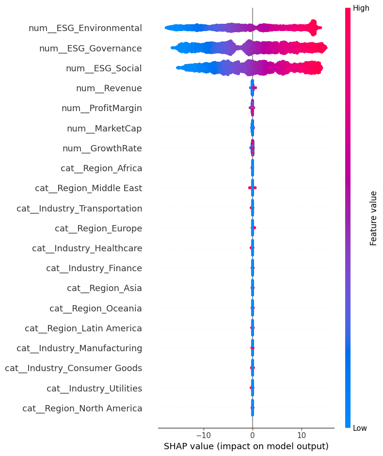

# AI-Driven ESG Risk Intelligence Platform

## Business Problem
Manual assessment of Environmental, Social, and Governance (ESG) risks from large volumes of unstructured news and company data is time-consuming, subjective, and difficult to scale. Investors, organizations, and regulators require transparent and data-driven ESG risk evaluation to support responsible and informed decision-making.

## Proposed AI Solution
This project aims to develop an AI-driven ESG risk intelligence platform that applies machine learning and natural language processing to ESG-related data. The system is designed to:
- Predict ESG risk scores (regression)
- Classify ESG risk levels (low, medium, high)
- Explain model predictions using explainable AI techniques (SHAP)
- Enable natural-language ESG question answering through a Retrieval-Augmented Generation (RAG) approach

## Project Roadmap
This repository is intentionally developed **phase by phase** to reflect real-world AI system development:

- Phase 0: Project foundation and business problem definition  
- Phase 1: ESG risk score prediction (regression)  
- Phase 2: ESG risk level classification  
- Phase 3: Explainable AI using SHAP  
- Phase 4: ESG news sentiment analysis using FinBERT  
- Phase 5: RAG-based ESG question answering  
- Phase 6: Streamlit application integration
## Phase 1 – ESG Risk Score Regression (Baseline Completed)

Phase 1 focuses on building a clean and reliable baseline model to predict ESG risk scores from structured ESG and financial data.

**What was implemented:**
- Modular data preprocessing using `Pipeline` and `ColumnTransformer`
- Proper train-test split with prevention of data leakage
- Baseline Linear Regression model
- Model evaluation using MAE, RMSE, and R² metrics
- Trained model and preprocessing pipeline saved for reuse

This phase establishes a strong foundation for further model improvements and downstream ESG risk analysis.

## Phase 1.1 – Regression Model Improvement (Random Forest)

To improve upon the baseline Linear Regression model, a Random Forest Regressor was introduced to capture non-linear relationships and feature interactions within ESG and financial data.

**Enhancements introduced:**
- Random Forest Regressor trained using the same preprocessing and train-test split
- Fair model comparison using MAE, RMSE, and R² metrics
- Automated selection of the best-performing model based on test RMSE
- Best model persisted for downstream usage

This enhancement demonstrates a systematic approach to model improvement while maintaining evaluation fairness and reproducibility.

## Phase 2 – ESG Risk Level Classification

In Phase 2, the project extends beyond predicting a numerical ESG risk score by introducing a classification system that categorizes companies into interpretable ESG risk levels.

To achieve this, the continuous ESG risk score was converted into categorical labels using defined thresholds:

Low Risk

Medium Risk

High Risk

This transformation enables easier interpretation for business stakeholders such as investors, analysts, and compliance teams.

The classification pipeline reuses the existing preprocessing workflow developed in Phase 1 to maintain consistency and prevent duplicated data handling logic.

A baseline multiclass classification model using Logistic Regression was trained and evaluated using accuracy and detailed classification metrics including precision, recall, and F1-score.

This phase establishes a structured classification framework for ESG risk analysis.

## Phase 2.1 – Model Improvement with Random Forest Classifier

After establishing Logistic Regression as a baseline classifier, the model performance was further improved by introducing a Random Forest Classifier.

Random Forest was selected because it can capture non-linear relationships and complex feature interactions that are common in ESG and financial datasets.

Both models were trained using the same preprocessing pipeline and evaluated using consistent classification metrics to ensure a fair comparison.

The system automatically selects and saves the best-performing model based on evaluation results, ensuring that the most effective classifier is used for downstream prediction tasks.

## Phase 03 – SHAP Explainability

In Phase 03, Explainable AI (XAI) was introduced using SHAP (SHapley Additive exPlanations) to improve transparency and interpretability of ESG risk predictions.

The SHAP module was integrated with the existing preprocessing and Random Forest pipeline to analyze how individual features contribute to ESG risk predictions.

### Key Enhancements

- Global feature importance visualization
- Pipeline-compatible SHAP integration
- Transformed feature name extraction using `get_feature_names_out()`
- Business-interpretable ESG feature analysis
- Reusable modular explainability architecture

### SHAP Summary Plot

### Insights

The SHAP visualization demonstrates that ESG Environmental, ESG Governance, and ESG Social indicators are among the most influential contributors to ESG risk prediction.

## Phase 04 – Fianancial NLP Sentiment Intelligence

### Objective

Enhance ESG risk analysis by incorporating sentiment intelligence from unstructured ESG-related news articles using transformer-based NLP techniques.

### Key Technologies
FinBERT (ProsusAI/finbert)
Hugging Face Transformers
PyTorch
Pandas
ESG News Dataset

### Implementation Overview
### FinBERT Sentiment Analysis

Implemented a transformer-based sentiment analysis pipeline using FinBERT, a domain-specific language model pre-trained on financial text. The model analyzes ESG and financial news articles and generates:

Sentiment Label (Positive, Negative, Neutral)
Confidence Score

Example Output:

{
    "sentiment": "positive",
    "confidence": 0.9542
}
### Batch Sentiment Scoring Pipeline

Developed a batch processing workflow capable of scoring sentiment across large ESG news datasets. The pipeline:

1. Loads ESG news headlines.
2. Applies FinBERT inference.
3. Generates sentiment predictions.
4. Stores confidence scores.
5. Creates sentiment-enriched ESG datasets for downstream analysis.
   

### Validation & Debugging

A comprehensive validation process was conducted to ensure prediction reliability.

During testing, positive financial news was incorrectly displayed as negative sentiment. Investigation revealed that the issue originated from an incorrect manual label mapping rather than the FinBERT model itself.

### Debugging Process:

Verified input text processing.
Examined model logits.
Inspected official FinBERT label configuration.
Identified label mapping mismatch.
Corrected sentiment interpretation layer.

Official FinBERT Label Mapping:

{
    0: "positive",
    1: "negative",
    2: "neutral"
}

After correction, sentiment predictions aligned with financial context and expected model behavior.

### Outcomes

✅ Transformer-based ESG sentiment analysis

✅ FinBERT integration using Hugging Face Transformers

✅ PyTorch inference pipeline

✅ Confidence score generation

✅ Batch sentiment scoring workflow

✅ Sentiment-enriched ESG news dataset creation

✅ Model validation and debugging

✅ Modular NLP architecture for future RAG integration

### Business Value

The sentiment intelligence layer enables the platform to analyze unstructured ESG news alongside structured ESG metrics, providing richer insights for investors, analysts, and decision-makers. This creates a stronger foundation for future Retrieval-Augmented Generation (RAG) and ESG question-answering capabilities.

### Phase 05: ESG RAG (Retrieval-Augmented Generation) Question Answering System

## Objective

To enable intelligent ESG-related question answering by retrieving relevant ESG news articles and generating context-aware responses using a Large Language Model (LLM).

## Key Features
Semantic document retrieval using Sentence Transformers embeddings.
Vector database integration using ChromaDB.
Retrieval of ESG-related news articles based on user queries.
Context construction from retrieved ESG documents.
Answer generation using Google's FLAN-T5 Base model.
Grounded responses based on retrieved ESG evidence to reduce hallucinations.

## RAG Architecture

User Question

↓

Sentence Transformer (all-MiniLM-L6-v2)

↓

ChromaDB Similarity Search

↓

Top Relevant ESG Articles Retrieved

↓

Context Construction

↓

FLAN-T5 Base

↓

Generated ESG Answer

## Technologies Used

Python
Sentence Transformers
ChromaDB
Hugging Face Transformers
FLAN-T5 Base
Pandas

## Example Query

## Question:
Why was Tesla removed from the ESG index?

## Generated Answer:
The retrieved ESG articles indicate that Tesla's removal from the ESG index sparked debate among investors regarding ESG evaluation criteria. The documents discuss concerns related to ESG rating methodologies, sustainability interpretations, governance considerations, and broader ESG assessment practices.

Outcome

Successfully implemented an end-to-end Retrieval-Augmented Generation (RAG) pipeline capable of retrieving ESG-related information from a news corpus and generating context-aware answers using an LLM.

## Tech Stack (Planned)
- Python  
- Pandas, NumPy, Scikit-learn  
- PyTorch & Hugging Face Transformers  
- SHAP (Explainable AI)  
- Sentence Transformers, FAISS  
- Streamlit  

---
